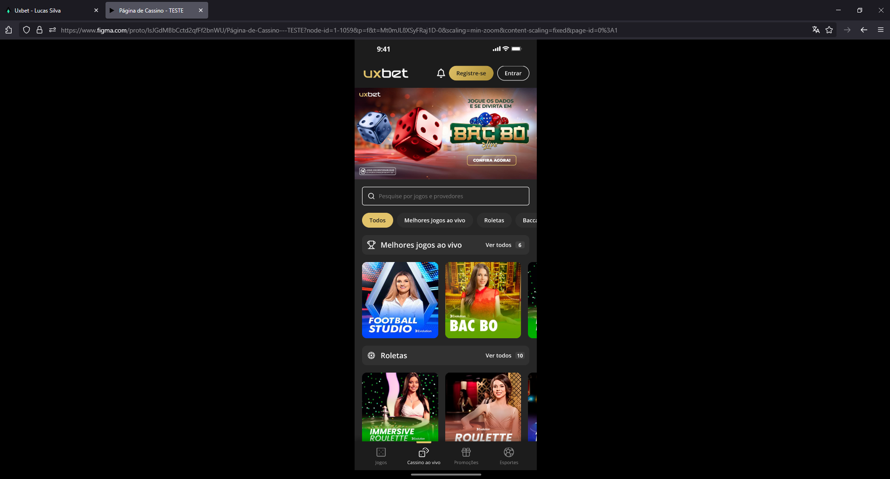
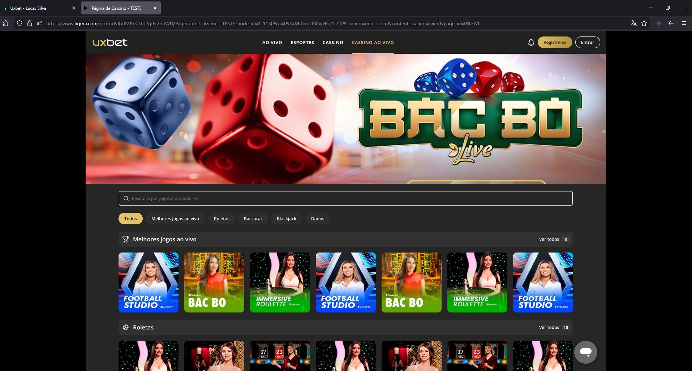
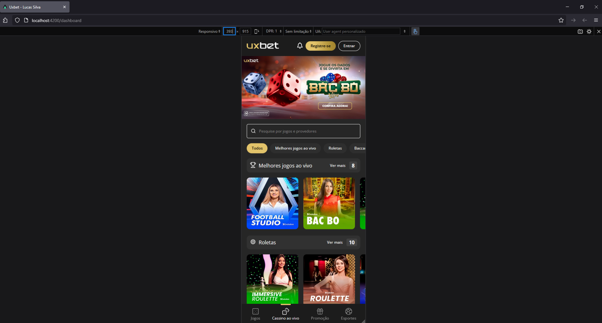

# Projeto iGaming Dashboard

Este projeto é um **teste técnico para desenvolvedor(a) Angular Pleno**, com o objetivo de reproduzir uma interface de dashboard de uma plataforma de iGaming. A aplicação foi desenvolvida com **Angular (v15)**, utilizando **SCSS** para estilização e **dados mockados (estáticos)** para simular o consumo de uma API.

O foco principal foi na **fidelidade visual** ao design fornecido no Figma, **responsividade** (desktop e mobile com mobile-first) e aplicação de **boas práticas de código**, organização e arquitetura.

---

## 🚀 Tecnologias Utilizadas

- **Angular 15**: Framework principal para o desenvolvimento da interface.
- **SCSS**: Pré-processador CSS para uma estilização modular e organizada.
- **Dados Estáticos (JSON)**: Simulação de uma API para o consumo de informações.
- **Jest**: Framework de testes utilizado para os testes unitários.

---

## 🛠️ Estrutura do Projeto

O projeto foi estruturado com base em **componentes modulares** e **separação de responsabilidades**, visando a manutenibilidade e escalabilidade do código.

- `src/app/core/`: Contém serviços essenciais e utilitários que são utilizados em toda a aplicação (ex: serviços para dados mockados).
- `src/app/features/`: Abriga os módulos de funcionalidades específicas da aplicação (ex: o módulo `dashboard` ou outras páginas de conteúdo).
- `src/app/layout/`: Responsável pela estrutura de layout principal das páginas, incluindo cabeçalhos, rodapés e demais funcionalidades do layout.
- `src/app/shared/`: Contém componentes, diretivas e pipes reutilizáveis que podem ser compartilhados entre diferentes módulos da aplicação.
- `src/assets/data/`: **Armazena os arquivos JSON com os dados estáticos que simulam a resposta de uma API.**
- `src/styles/`: Arquivos SCSS globais e variáveis, garantindo padronização na estilização de toda a aplicação.

---

## 💻 Destaques do Desenvolvimento

- **Abordagem "Built From Scratch"**: Todos os componentes da interface foram construídos **integralmente do zero**, sem o uso de bibliotecas de componentes UI (como PrimeNG, Material UI, etc.). Essa escolha estratégica permitiu demonstrar total domínio sobre **HTML semântico**, **SCSS avançado** (incluindo responsividade e animações) e as **capacidades reativas do Angular**.
- **Fidelidade Pixel-Perfect ao Design**: A interface foi desenvolvida com extrema atenção aos detalhes, garantindo uma reprodução **pixel-perfect** do layout fornecido no Figma. Cores, tipografia, espaçamentos e alinhamentos foram implementados com precisão, resultando em uma experiência visual idêntica à proposta original.
  - O design original pode ser consultado aqui no Figma: [https://www.figma.com/design/IsJGdMBbCctd2qfFf2bnWU/P%C3%A1gina-de-Cassino---TESTE?node-id=0-1](https://www.figma.com/design/IsJGdMBbCctd2qfFf2bnWU/P%C3%A1gina-de-Cassino---TESTE?node-id=0-1)
- **Responsividade com Estratégia Mobile-First**: A aplicação foi concebida com uma abordagem **mobile-first**, garantindo que o layout se adapte fluidamente a diferentes tamanhos de tela (desde dispositivos móveis até desktops). Essa estratégia otimiza a performance e a experiência do usuário em qualquer dispositivo.
- **Organização e Boas Práticas**: O código é limpo, semântico e bem organizado, seguindo as diretrizes do Angular e as melhores práticas de desenvolvimento front-end. A modularização do SCSS, com uso de variáveis e mixins, facilita a manutenção e a escalabilidade.
- **Testes Unitários (Jest)**: Testes unitários foram implementados utilizando o **Jest** para garantir a correção e a robustez dos componentes e serviços principais, validando o comportamento esperado da aplicação e assegurando a qualidade do código.

---

## 📸 Screenshots

Para uma visualização rápida da aplicação, confira as capturas de tela abaixo:

| Mobile Figma                                                                                    | Desktop Figma                                                                                     |
| ----------------------------------------------------------------------------------------------- | ------------------------------------------------------------------------------------------------- |
|  |  |

| Mobile Aplicação                                                                                            | Desktop Aplicação                                                                                             |
| ----------------------------------------------------------------------------------------------------------- | ------------------------------------------------------------------------------------------------------------- |
|  |  |

---

## ⚙️ Como Rodar o Projeto

Siga os passos abaixo para configurar e executar o projeto em sua máquina local.

### Pré-requisitos

Certifique-se de ter o **Node.js** e o **Angular CLI** instalados globalmente.

- **Node.js**: [https://nodejs.org/](https://nodejs.org/)
- **Angular CLI**: Instale via npm:
  ```bash
  npm install -g @angular/cli@15
  ```

### Instalação

1.  **Clone o repositório:**
    ```bash
    git clone https://github.com/Lusques/reals-bet-frontend.git
    ```
2.  **Navegue até o diretório do projeto:**
    ```bash
    cd reals-bet-frontend
    ```
3.  **Instale as dependências:**
    ```bash
    npm install
    ```

### Execução

Para iniciar o servidor de desenvolvimento:

```bash
ng serve
```

Para iniciar os testes:

```bash
ng test
```
